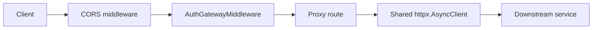

# API Gateway Architecture

## Purpose

`apigetaway` is the public HTTP edge of the backend.

It owns:

- JWT validation for external traffic;
- trusted identity header construction;
- proxying to downstream services;
- public vs protected path enforcement;
- patched downstream OpenAPI exposure.

It does not own:

- business state from `auth`, `user`, `project`, or `notificate`;
- persistence or migrations;
- broker consumers or background jobs.

## Runtime Model

The service runs as a single FastAPI process from [main.py](../main.py).

Startup responsibilities:

- load downstream service URLs and auth settings from [app/config.py](../app/config.py);
- build a shared `httpx.AsyncClient` via [app/ioc.py](../app/ioc.py);
- wire Dishka into FastAPI;
- install CORS and auth middleware from [app/setup.py](../app/setup.py);
- register route groups for `auth`, `user`, `admin/user`, `project`, and docs.

There is no database and no broker runtime in this service.

## Composition Root

Primary files:

- [main.py](../main.py)
- [app/config.py](../app/config.py)
- [app/ioc.py](../app/ioc.py)
- [app/setup.py](../app/setup.py)

These files define:

- which downstream services exist;
- which JWT claims are trusted;
- which paths are public or protected;
- how proxy requests are executed.

## Owned Data

| Area | Ownership |
| --- | --- |
| JWT validation config | Local config only |
| Downstream service addresses | Local config only |
| Trusted user headers | Derived per request, never persisted |
| Domain state | None |

## Inbound Interfaces

### Public HTTP entrypoints

| Surface | Purpose | Backing module |
| --- | --- | --- |
| `/health` | Process health check for Docker readiness | [main.py](../main.py) |
| `/auth/*` | Proxy to auth service | [auth.py](../app/presentation/api/v1/routes/auth.py) |
| `/user/*` | Proxy to user service | [users.py](../app/presentation/api/v1/routes/users.py) |
| `/admin/user/*` | Admin-only proxy to user service | [users.py](../app/presentation/api/v1/routes/users.py) |
| `/project/*` | Proxy to project service | [projects.py](../app/presentation/api/v1/routes/projects.py) |
| `/{service}/docs`, `/{service}/redoc` | Docs hub pages | [docs.py](../app/presentation/api/v1/routes/docs.py) |

### Public path exceptions

| Path pattern | Why it is public |
| --- | --- |
| `/admin/user/openapi.json` | Admin user docs schema |
| `/admin/user/docs` | Admin user docs UI |
| `/admin/user/redoc` | Admin user ReDoc UI |
| `/user/confirmations/*` | One-click reservation confirmation from email |

Project invitation links use `/user/project-invitations/*` and intentionally remain protected by the normal `/user/*` gateway auth path so `user` receives trusted `X-User-Id`.

## Outbound Interfaces

### Trusted headers forwarded downstream

| Downstream surface | Headers | Notes |
| --- | --- | --- |
| `/auth/*` | `X-User-Id`, `X-User-Token-Type`, `X-User-Is-Superuser` | Forwarded only on protected auth routes |
| `/user/*` | `X-User-Id`, `X-User-Token-Type`, `X-User-Is-Superuser` | `/users/me` is rewritten to the caller id before proxying |
| `/project/*` | `X-User-Id`, `X-User-Token-Type`, `X-User-Is-Superuser` | `project` currently reads `X-User-Id`, the other headers are pass-through |
| `/admin/user/*` | `X-User-Id`, `X-User-Token-Type` | `X-User-Id` is rewritten to the target user id from the admin path; `X-User-Is-Superuser` stays in gateway and is used only for access control |

### Downstream proxy routes

| Downstream service | Base config | Notes |
| --- | --- | --- |
| `auth` | `AUTH_URL` | Standard proxy and patched OpenAPI |
| `user` | `USER_URL` | Supports `/users/me` rewrite and admin proxy |
| `project` | `PROJECT_URL` | Standard proxy and patched OpenAPI |

## Key Flows

### Protected request flow

Flow:

1. Request enters FastAPI.
2. Middleware checks whether the path is public or protected.
3. For protected paths, bearer token is extracted and validated.
4. Trusted headers are derived from JWT payload.
5. Proxy route forwards the request with rebuilt headers.

### OpenAPI patch flow

1. Gateway fetches downstream `/openapi.json`.
2. Paths are prefixed under `/auth`, `/user`, `/admin/user`, or `/project`.
3. Internal transport headers are stripped from visible schema parameters.
4. Protected operations receive `bearerAuth`.
5. User-specific paths may be rewritten to `/users/me`.

## Change Playbooks

- Public path change: update middleware public-path list, docs expectations, and gateway tests.
- Trusted header or JWT-claim change: update middleware, proxy forwarding, downstream expectations, and tests.
- Proxy path rewrite change: keep runtime rewrite and patched OpenAPI rewrite aligned.
- New proxied route or service: update route module, config, protected-path handling, and docs.

## Known Traps

- Trusting incoming `x-user-*` headers from clients.
- Breaking `/users/me` proxy rewriting while OpenAPI still advertises old paths.
- Forgetting to patch OpenAPI when adding or reshaping routes.
- Weakening admin-only routing by changing payload or header assumptions.

## Validation / Testing Focus

- [tests/test_auth_headers.py](../tests/test_auth_headers.py)
- [tests/test_auth_openapi_patch.py](../tests/test_auth_openapi_patch.py)
- [tests/test_public_confirmation_path.py](../tests/test_public_confirmation_path.py)
- [tests/test_access_denied_handler.py](../tests/test_access_denied_handler.py)

## Current Limitations

- no rate limiting;
- no circuit breaker or retry policy for downstream HTTP;
- no response aggregation across services;
- no service discovery beyond static config;
- OpenAPI patching is request-time, not precomputed.
