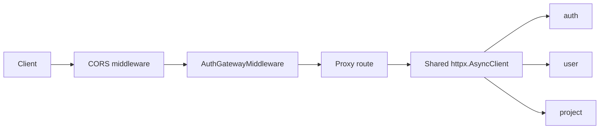

# API Gateway Architecture

## Purpose

`apigetaway` is the public HTTP edge of the backend. It does not own business data. Its job is to:

- terminate external HTTP traffic;
- validate JWT on protected routes;
- inject trusted user headers for downstream services;
- proxy requests to `auth`, `user`, and `project`;
- expose a unified documentation hub with patched downstream OpenAPI specs.

Out of scope:

- domain rules of auth, user, or project;
- persistence and migrations;
- asynchronous messaging and background work;
- reservation orchestration.

## Runtime Model

The service is a single FastAPI process created in [main.py](../main.py).

At startup it:

- loads downstream service addresses and JWT settings from [app/config.py](../app/config.py);
- creates one shared `httpx.AsyncClient` through [app/ioc.py](../app/ioc.py);
- wires Dishka into FastAPI;
- installs CORS and auth middleware from [app/setup.py](../app/setup.py);
- mounts route groups for `auth`, `user`, `admin/user`, `project`, and docs.

There is no database, no broker, and no worker process in this service.

## Composition Root

Main composition files:

- [main.py](../main.py)
- [app/config.py](../app/config.py)
- [app/ioc.py](../app/ioc.py)
- [app/setup.py](../app/setup.py)

These files define the edge contract of the service:

- which downstream services exist;
- which routes are protected;
- which JWT claim names are trusted;
- which middleware is active for every request.

## Layered Structure

### Presentation

Files:

- [app/presentation/api/v1/routes/auth.py](../app/presentation/api/v1/routes/auth.py)
- [app/presentation/api/v1/routes/users.py](../app/presentation/api/v1/routes/users.py)
- [app/presentation/api/v1/routes/projects.py](../app/presentation/api/v1/routes/projects.py)
- [app/presentation/api/v1/routes/docs.py](../app/presentation/api/v1/routes/docs.py)
- [app/presentation/middleware/auth.py](../app/presentation/middleware/auth.py)

Responsibilities:

- expose proxy endpoints under `/auth`, `/user`, `/admin/user`, `/project`;
- render documentation pages through Jinja templates;
- enforce admin-only access for `/admin/user/*`;
- perform user-path rewrites such as `/users/me`.

### Application

Files:

- [app/application/errors.py](../app/application/errors.py)

Responsibilities:

- define service-level exceptions used by middleware and route handlers.

The application layer here is intentionally thin. This service is an edge adapter, not a business domain.

### Infrastructure

Files:

- [app/infrastructure/security/jwt_validator.py](../app/infrastructure/security/jwt_validator.py)
- [app/key/public_key.pem](../app/key/public_key.pem)

Responsibilities:

- validate bearer tokens using the configured public key;
- isolate JWT parsing from route code.

## Request Pipeline

### Protected request flow

1. A request hits FastAPI and passes through CORS middleware.
2. [AuthGatewayMiddleware](../app/presentation/middleware/auth.py) checks whether the path is public, protected, or ignored.
3. For protected paths it extracts `Authorization: Bearer ...`.
4. The middleware validates the token with `JWTValidator`.
5. It writes trusted headers and decoded payload into `request.state`.
6. The selected proxy route forwards the request to the downstream service with rewritten headers.

### Public request flow

The middleware bypasses token validation for:

- explicit public docs endpoints;
- `OPTIONS`;
- `/user/confirmations/*`, which must stay public for one-click reservation confirmation from email.

## Proxy Topology

### Auth proxy

Route module:

- [app/presentation/api/v1/routes/auth.py](../app/presentation/api/v1/routes/auth.py)

Responsibilities:

- forward auth traffic to the `auth` service;
- patch OpenAPI under `/auth/openapi.json`;
- remove internal trusted headers from proxied docs.

### User proxy

Route module:

- [app/presentation/api/v1/routes/users.py](../app/presentation/api/v1/routes/users.py)

Responsibilities:

- proxy all regular user traffic under `/user/*`;
- rewrite `/user/users/me/...` to the real `user_id` from JWT;
- expose `/admin/user/*` for admin-only operations;
- keep `/user/confirmations/*` public;
- patch both user and admin-user OpenAPI documents.

### Project proxy

Route module:

- [app/presentation/api/v1/routes/projects.py](../app/presentation/api/v1/routes/projects.py)

Responsibilities:

- proxy project traffic under `/project/*`;
- forward trusted user headers to `project`;
- patch project OpenAPI and mark protected operations.

### Documentation hub

Route module:

- [app/presentation/api/v1/routes/docs.py](../app/presentation/api/v1/routes/docs.py)

Responsibilities:

- render HTML pages for Swagger/ReDoc wrappers;
- present downstream docs behind one gateway host.

## Security Model

The gateway is the only service that should trust external bearer tokens directly.

It passes downstream identity through trusted headers:

- `X-User-Id`
- `X-User-Token-Type`
- `X-User-Is-Superuser`

Important implications:

- downstream services can validate identity from trusted headers instead of parsing JWT themselves;
- external clients must not be allowed to spoof these headers, so the gateway strips and rebuilds them;
- admin routes are checked against the decoded JWT payload before proxying.

## OpenAPI Aggregation Strategy

Each downstream service keeps its own native OpenAPI schema. The gateway does not build a schema from local code. Instead it:

1. fetches downstream `/openapi.json`;
2. prefixes every path with `/auth`, `/user`, `/admin/user`, or `/project`;
3. rewrites user-specific paths like `/users/{user_id}` to `/users/me` where appropriate;
4. strips internal transport headers from visible schema parameters;
5. injects `bearerAuth` into operations matched by `PROTECTED_PATH_PATTERNS`.

This keeps service docs close to source while still presenting a single public entrypoint.

## Configuration

Main config groups in [app/config.py](../app/config.py):

- `Services`
- `AuthGatewaySettings`
- `ProtectedPathsSettings`

Important env vars:

- `AUTH_URL`
- `USER_URL`
- `PROJECT_URL`
- `AUTH_ALGORITHM`
- `AUTH_PUBLIC_KEY_PATH`
- `AUTH_USER_ID_CLAIM`
- `AUTH_TOKEN_TYPE_CLAIM`
- `PROTECTED_PATH_PATTERNS`

## Testing Focus

Current tests in [tests](../tests) cover the edge-specific behavior:

- trusted header propagation;
- access-denied handling;
- OpenAPI patching;
- public confirmation path bypass.

## Current Limitations

- no rate limiting or throttling;
- no circuit breaker or retry policy for downstream HTTP calls;
- no response aggregation across services;
- no service discovery beyond static config;
- docs are patched on demand, not cached as a build artifact.
