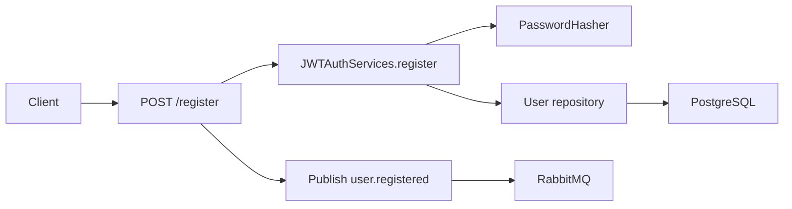

# Auth Service Architecture

## Purpose

`auth` owns credential-based identity.

It owns:

- auth-user persistence;
- password hashing and verification;
- access and refresh token issuance;
- admin-facing auth-user CRUD;
- publication of `user.registered`.

It does not own:

- user profiles or resources;
- availability or reservations;
- project workflow state.

## Runtime Model

The service runs as a single FastAPI process from [main.py](../main.py).

Startup responsibilities:

- load config from [app/config.py](../app/config.py);
- create a FastStream `RabbitBroker`;
- create a Dishka container from [app/ioc.py](../app/ioc.py);
- start SQLAlchemy mappings;
- declare the `user.registered` exchange;
- register API routes from [app/presentations/api.py](../app/presentations/api.py).

Runtime dependencies:

- PostgreSQL for auth-user persistence;
- RabbitMQ for integration events;
- local RSA keypair files for JWT signing and validation.

## Composition Root

Primary files:

- [main.py](../main.py)
- [app/config.py](../app/config.py)
- [app/ioc.py](../app/ioc.py)
- [app/application/use_case/authenticate_uc.py](../app/application/use_case/authenticate_uc.py)

These files assemble:

- config and logging;
- DB engine, sessionmaker, and transaction manager;
- repository implementations;
- password hasher and JWT services;
- RabbitMQ publisher dependency.

## Owned Data

| Area | Ownership |
| --- | --- |
| Auth users | Full ownership in local DB |
| Password hashes | Full ownership in local DB |
| JWT signing keys | Local files and config |
| Refresh token persistence | None |
| User profile data | Not owned |

## Inbound Interfaces

### Public HTTP

| Endpoint area | Purpose |
| --- | --- |
| `POST /register` | Create auth user and emit `user.registered` |
| `POST /login` | Verify credentials and issue tokens |
| `POST /refresh` | Rotate access and refresh tokens |
| `GET /logout` | Remove refresh cookie client-side |
| `POST /admin/users` | Admin-only auth-user creation and `user.registered` publication |
| `GET /admin/users` | Admin-only auth-user listing |
| `GET /admin/users/{user_id}` | Admin-only auth-user read by identifier |
| `PATCH /admin/users/{user_id}` | Admin-only auth-user updates including `is_active` |
| `DELETE /admin/users/{user_id}` | Admin-only auth-user deletion |

## Outbound Interfaces

### JWT claims

| Claim | Meaning | Main readers |
| --- | --- | --- |
| `sub` | User identifier | `apigetaway`, downstream services via trusted headers |
| `type` | Token type, such as `access` or `refresh` | `auth`, `apigetaway` |
| `is_superuser` | Admin flag for access tokens | `apigetaway`, admin access logic |

### Refresh-token transport

| Property | Current behavior |
| --- | --- |
| Carrier | HTTP-only cookie |
| Set on | `POST /login`, `POST /refresh` |
| Cleared on | `POST /refresh` replacement and `GET /logout` |
| Server-side revocation store | None |

### `user.registered` event contract

| Field | Meaning |
| --- | --- |
| `user_id` | Auth user identifier |
| `email` | User email |
| `is_active` | Active flag |
| `is_superuser` | Admin flag |
| `is_verified` | Verification flag |
| `create_at` | Creation timestamp |

## Key Flows

### Registration

### Admin user management

1. Gateway forwards trusted admin headers.
2. `require_admin_access` verifies access-token type and `is_superuser=true`.
3. `AdminUserService` performs CRUD against the auth-user repository.
4. Admin endpoints never allow a resulting state with `is_superuser=true` and `is_active=false`.
5. Admin user creation also publishes `user.registered`.

### Login

1. API accepts credentials through `OAuth2PasswordRequestForm`.
2. `JWTAuthServices` loads auth user by email.
3. Password hash is verified.
4. Access and refresh tokens are created.
5. Access token is returned in JSON and refresh token in cookie.

### Refresh

1. API reads refresh cookie.
2. JWT service decodes and validates token type.
3. User is reloaded from DB.
4. New access and refresh tokens are issued.

## Change Playbooks

- JWT claim change: update token creation, gateway readers, docs, and tests.
- Refresh-cookie change: update API behavior, docs, and any gateway assumptions.
- `user.registered` payload change: update producer, user consumer, docs, and interservice tests.
- Admin access change: update access checks, trusted-header expectations, and tests.

## Known Traps

- Changing claim names without updating `apigetaway`.
- Assuming logout revokes already-issued tokens.
- Mixing profile or reservation logic into auth-owned persistence.
- Changing `user.registered` shape without updating `user`.

## Validation / Testing Focus

- [tests/test_admin_access.py](../tests/test_admin_access.py)
- [tests/test_access_denied_handler.py](../tests/test_access_denied_handler.py)
- gateway tests too when claims or trusted-header expectations change

## Current Limitations

- no token revocation store;
- no password reset flow;
- no email verification workflow;
- no audit trail for auth events;
- registration event publication is best-effort, not outbox-backed.
