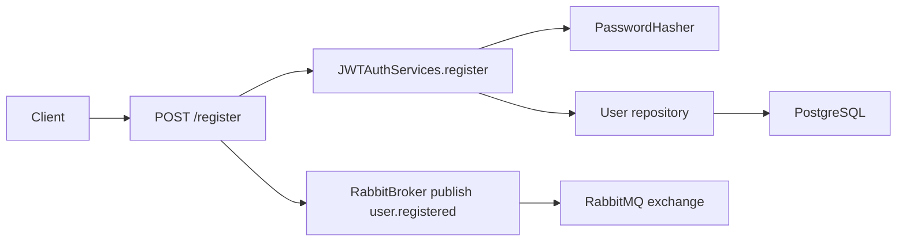

# Auth Service Architecture

## Purpose

`auth` owns authentication and credential-based identity inside the backend.

It is the source of truth for:

- registered accounts and their credentials;
- access and refresh JWT issuance;
- admin-facing listing of auth accounts;
- publication of the `user.registered` integration event.

It does not own:

- user profile description;
- equipment and availability;
- projects and reservations.

Those concerns live in `user` and `project`.

## Runtime Model

The service runs as one FastAPI process created in [main.py](../main.py).

At startup it:

- loads settings from [app/config.py](../app/config.py);
- creates a FastStream `RabbitBroker`;
- creates a Dishka container via [app/ioc.py](../app/ioc.py);
- starts ORM mappings from `infrastructure.adapters.orm`;
- declares the `user.registered` exchange;
- mounts HTTP routes from [app/presentations/api.py](../app/presentations/api.py).

Runtime dependencies:

- PostgreSQL for account persistence;
- RabbitMQ for the registration event;
- RSA keypair from [app/key](../app/key).

## Composition Root

Main composition files:

- [main.py](../main.py)
- [app/config.py](../app/config.py)
- [app/ioc.py](../app/ioc.py)
- [app/set_log.py](../app/set_log.py)

These files bind together:

- settings;
- database session factory;
- transaction manager;
- JWT services;
- password hashing;
- repository implementations;
- RabbitMQ broker instance.

## Layered Structure

### Presentation

Files:

- [app/presentations/api.py](../app/presentations/api.py)
- [app/presentations/schemas.py](../app/presentations/schemas.py)
- [app/presentations/access.py](../app/presentations/access.py)
- [app/presentations/handlers.py](../app/presentations/handlers.py)

Responsibilities:

- expose HTTP endpoints for register, login, refresh, logout, and admin user listing;
- convert headers/forms/body into use-case input;
- publish the `user.registered` integration event after successful registration;
- map domain/application errors to HTTP responses.

### Application

Files:

- [app/application/use_case/authenticate_uc.py](../app/application/use_case/authenticate_uc.py)
- [app/application/ports](../app/application/ports)
- [app/application/common](../app/application/common)
- [app/application/errors](../app/application/errors)

Responsibilities:

- orchestrate registration and login;
- manage transactional boundaries through ports;
- express repository and security dependencies as abstractions;
- implement admin-facing pagination/filtering over accounts.

The central application service is `JWTAuthServices`.

### Domain

Files:

- [app/domain/entities.py](../app/domain/entities.py)
- [app/domain/values.py](../app/domain/values.py)
- [app/domain/errors](../app/domain/errors)

Responsibilities:

- define the auth user entity;
- define strong types such as `Email`;
- enforce basic domain invariants around account identity.

### Infrastructure

Files:

- [app/infrastructure/database.py](../app/infrastructure/database.py)
- [app/infrastructure/transactions.py](../app/infrastructure/transactions.py)
- [app/infrastructure/adapters/repository.py](../app/infrastructure/adapters/repository.py)
- [app/infrastructure/adapters/orm.py](../app/infrastructure/adapters/orm.py)
- [app/infrastructure/adapters/broker.py](../app/infrastructure/adapters/broker.py)
- [app/infrastructure/security/jwt.py](../app/infrastructure/security/jwt.py)
- [app/infrastructure/security/password_hasher.py](../app/infrastructure/security/password_hasher.py)

Responsibilities:

- map domain entities to SQLAlchemy tables;
- persist and query auth users;
- create and decode JWTs;
- hash and verify passwords;
- declare RabbitMQ exchange topology.

## Main Flows

### Registration

Flow:

1. API receives email and password.
2. `JWTAuthServices.register` validates uniqueness by email.
3. Password is hashed before persistence.
4. The new account is committed in PostgreSQL.
5. API publishes `user.registered`.
6. `user` consumes this event and builds its own local user projection.

### Login

Flow:

1. API accepts `OAuth2PasswordRequestForm`.
2. `JWTAuthServices.login` loads user by email.
3. Password hash is verified.
4. `JWTServices` creates access and refresh tokens.
5. Access token is returned in JSON.
6. Refresh token is stored in an HTTP-only cookie.

### Refresh

Flow:

1. API reads refresh token from cookie.
2. `JWTServices` decodes and validates it.
3. The service reloads the user from the database.
4. A new access token and refresh token are issued.
5. Cookie is replaced atomically in the HTTP response.

### Admin listing

The `/users` endpoint is not public. It depends on trusted headers forwarded by the gateway and checks admin access before listing users from the repository with pagination/filtering.

## Persistence Model

Persistence lives entirely in this service.

Current DB concerns:

- auth users table and migrations in [migrations](../migrations);
- async SQLAlchemy session lifecycle in [app/infrastructure/database.py](../app/infrastructure/database.py);
- transaction handling in [app/infrastructure/transactions.py](../app/infrastructure/transactions.py).

This service does not share tables with other services. Downstream services receive user creation through events, not foreign keys across service databases.

## Security Model

JWT behavior is defined by [app/infrastructure/security/jwt.py](../app/infrastructure/security/jwt.py) and settings in [app/config.py](../app/config.py).

Key points:

- access and refresh tokens use configured lifetime values;
- RSA keys are loaded from local PEM files at startup;
- refresh token is transported in cookie form;
- admin access is inferred from trusted headers populated by the gateway.

Known simplification:

- logout does not currently implement token revocation or blacklist persistence.

## Integration Contract

Outgoing event:

- exchange: `user.registered`
- routing key: `user.registered`
- publisher declaration: [app/infrastructure/adapters/broker.py](../app/infrastructure/adapters/broker.py)

This event is the bridge from `auth` to `user`. It keeps `auth` focused on credentials while `user` owns the richer profile model.

## Configuration

Main config groups in [app/config.py](../app/config.py):

- `Log`
- `Rabbitmq`
- `Auth`
- `DatabaseSettings`
- `SQLAlchemySettings`

Important env vars:

- `DATABASE_*`
- `RABBITMQ_*`
- `ACCESS_TOKEN_TIME_SECONDS`
- `REFRESH_TOKEN_TIME_SECONDS`
- `AUTH_ALGORITM`

## Testing Focus

Current tests in [tests](../tests) focus on:

- access denied behavior;
- admin access contract.

The service would benefit from deeper tests around token rotation, refresh misuse, and registration event delivery guarantees.

## Current Limitations

- no token revocation store;
- no password reset flow;
- no email verification workflow inside the service;
- no audit trail for auth events;
- event publication after registration is best-effort, not outbox-backed.
