# Notificate Architecture

## Purpose

`notificate` is a delivery-only service. It is responsible for transporting notification requests to email recipients, but it does not own business rules for reservation approval.

Current bounded context:
- consume email notification requests
- schedule background delivery
- send email through SMTP

Out of scope:
- building reservation state
- validating whether reservation is still allowed
- generating confirmation tokens
- moving domain entities to `RESERVED` or `RESERVE_FAILED`

## Layered Structure

### Presentation

Files:
- [api.py](../app/presentation/api.py)
- [broker.py](../app/presentation/broker.py)
- [tasks.py](../app/presentation/tasks.py)
- [schemas.py](../app/presentation/schemas.py)

Responsibilities:
- expose health endpoint
- accept broker messages from `user.events`
- define taskiq task entrypoints
- validate incoming event payloads

### Application

Files:
- [schedule_notifications.py](../app/application/commands/schedule_notifications.py)
- [send_email.py](../app/application/commands/send_email.py)
- [tasks.py](../app/application/ports/tasks.py)
- [email.py](../app/application/ports/email.py)

Responsibilities:
- orchestrate scheduling of background jobs
- convert use case input into delivery operations
- express dependencies via ports

### Infrastructure

Files:
- [smtp.py](../app/infrastructure/email/smtp.py)
- [dispatcher.py](../app/infrastructure/taskiq/dispatcher.py)
- [broker.py](../app/infrastructure/taskiq/broker.py)
- [queues.py](../app/infrastructure/broker/queues.py)

Responsibilities:
- integrate with SMTP server
- integrate with taskiq broker
- provide broker/exchange/queue declarations

### Composition Root

Files:
- [bootstrap.py](../app/bootstrap.py)
- [ioc.py](../app/ioc.py)
- [main.py](../main.py)
- [worker.py](../worker.py)

Responsibilities:
- create shared DI container
- create FastStream broker
- create Taskiq broker
- register tasks and middlewares
- wire Dishka for both FastAPI and Taskiq

## Runtime Model

The service has two processes:

1. HTTP and broker process
   - runs FastAPI
   - starts FastStream consumer
   - consumes `notification.email_requested`
   - invokes application scheduling handler

2. Taskiq worker process
   - executes `notificate.send_notification_email`
   - resolves dependencies via `dishka.integrations.taskiq`
   - sends SMTP email

## Event Flow

```mermaid
flowchart LR
    U["user service"] -->|"notification.email_requested"| N["notificate consumer"]
    N -->|"ScheduleNotificationEmailHandler"| D["Taskiq dispatcher"]
    D -->|"notificate.send_notification_email"| W["Taskiq worker"]
    W -->|"SendNotificationEmailHandler"| S["SMTP adapter"]
    S --> M["MailHog / SMTP server"]
```

## Current Contracts

Consumed routing key:
- `notification.email_requested`

Consumed exchange:
- `user.events`

Current template:
- `reservation_confirmation`

Required payload:
- `notification_id`
- `recipient_email`
- `subject`
- `template`
- `payload.confirm_url`
- `payload.project_title`
- `payload.shift_title`
- `payload.time_from`
- `payload.time_to`
- `payload.role` or `payload.resource_type`

## Taskiq Design

Current `taskiq` concepts in use:
- dedicated worker factory in [worker.py](../worker.py)
- shared broker factory in [bootstrap.py](../app/bootstrap.py)
- central task registration
- `SmartRetryMiddleware`
- `dishka.integrations.taskiq.inject`
- worker lifecycle hooks through `TaskiqEvents`

This replaced the older approach where the task created a runtime container lazily on each execution.

## Configuration

Main config groups in [config.py](../app/config.py):
- `Log`
- `Rabbitmq`
- `SMTP`
- `TaskIQ`

Important env vars:
- `RABBITMQ_HOST`
- `RABBITMQ_PORT`
- `RABBITMQ_DEFAULT_USER`
- `RABBITMQ_DEFAULT_PASS`
- `SMTP_HOST`
- `SMTP_PORT`
- `SMTP_FROM_EMAIL`
- `SMTP_FROM_NAME`
- `TASKIQ_DEFAULT_RETRY_COUNT`
- `TASKIQ_DEFAULT_RETRY_DELAY_SECONDS`

## Current Implementation Status

Implemented:
- broker consumer for `notification.email_requested`
- background dispatch to taskiq
- SMTP email sending
- reservation confirmation email body rendering
- MailHog-ready local environment
- health endpoint
- unit and interservice smoke coverage

Not implemented:
- multiple notification channels
- template storage/versioning
- delivery status persistence
- dead-letter queue strategy
- structured bounce handling
- retry policy per template or recipient
