# User Service

Сервис отвечает за профиль пользователя, его ресурсы (оборудование/реквизит), окна доступности и резервы времени.

## Что делает сервис
- хранит пользователя (`users`) из события `user.registered`;
- хранит описание пользователя (`descriptions`);
- хранит окна доступности пользователя (`free_users_timing`);
- хранит оборудование пользователя:
  - `microfons`
  - `cameras`
  - `camera_tripods`
  - `lights`
  - `light_tripods`
  - `sounds`
  - `requisites`
- хранит окна доступности оборудования (`*_free_times`);
- хранит изображения реквизита (`images`);
- резервирует интервал внутри существующего `free`-окна (`free -> reserved`).

## Схема БД (актуальная)

```mermaid
erDiagram
    USERS {
        uuid oid PK
        string email UK
        bool is_active
        bool is_superuser
        bool is_verified
        timestamptz create_at
    }

    DESCRIPTIONS {
        uuid oid PK
        uuid user_id FK 
        string username
        string phone
    }

    FREE_USERS_TIMING {
        uuid oid PK
        uuid user_id FK
        timestamptz start_time
        timestamptz end_time
        string status
    }

    MICROFONS {
        uuid oid PK
        uuid users_id FK
        string title
        string description
        string type
        timestamptz create_at
    }

    MICROFON_FREE_TIMES {
        uuid oid PK
        uuid microfon_id FK
        timestamptz start_time
        timestamptz end_time
        string status
    }

    CAMERAS {
        uuid oid PK
        uuid users_id FK
        string title
        string description
        string type
        timestamptz create_at
    }

    CAMERA_FREE_TIMES {
        uuid oid PK
        uuid camera_id FK
        timestamptz start_time
        timestamptz end_time
        string status
    }

    CAMERA_TRIPODS {
        uuid oid PK
        uuid users_id FK
        string title
        string description
        string type
        timestamptz create_at
    }

    CAMERA_TRIPOD_FREE_TIMES {
        uuid oid PK
        uuid camera_tripod_id FK
        timestamptz start_time
        timestamptz end_time
        string status
    }

    LIGHTS {
        uuid oid PK
        uuid users_id FK
        string title
        string description
        string type
        timestamptz create_at
    }

    LIGHT_FREE_TIMES {
        uuid oid PK
        uuid light_id FK
        timestamptz start_time
        timestamptz end_time
        string status
    }

    LIGHT_TRIPODS {
        uuid oid PK
        uuid users_id FK
        string title
        string description
        string type
        timestamptz create_at
    }

    LIGHT_TRIPOD_FREE_TIMES {
        uuid oid PK
        uuid light_tripod_id FK
        timestamptz start_time
        timestamptz end_time
        string status
    }

    SOUNDS {
        uuid oid PK
        uuid users_id FK
        string title
        string description
        string type
        timestamptz create_at
    }

    SOUND_FREE_TIMES {
        uuid oid PK
        uuid sound_id FK
        timestamptz start_time
        timestamptz end_time
        string status
    }

    REQUISITES {
        uuid oid PK
        uuid users_id FK
        string title
        string description
        string type
        string size
        timestamptz create_at
    }

    REQUISITE_FREE_TIMES {
        uuid oid PK
        uuid requisite_id FK
        timestamptz start_time
        timestamptz end_time
        string status
    }

    IMAGES {
        uuid oid PK
        uuid requisite_id FK
        string file
        string title
        string storage_key
        string bucket
        string mime_type
        bigint size
        string description
        timestamptz create_at
    }

    USERS ||--o| DESCRIPTIONS : has
    USERS ||--o{ FREE_USERS_TIMING : has

    USERS ||--o{ MICROFONS : owns
    MICROFONS ||--o{ MICROFON_FREE_TIMES : availability

    USERS ||--o{ CAMERAS : owns
    CAMERAS ||--o{ CAMERA_FREE_TIMES : availability

    USERS ||--o{ CAMERA_TRIPODS : owns
    CAMERA_TRIPODS ||--o{ CAMERA_TRIPOD_FREE_TIMES : availability

    USERS ||--o{ LIGHTS : owns
    LIGHTS ||--o{ LIGHT_FREE_TIMES : availability

    USERS ||--o{ LIGHT_TRIPODS : owns
    LIGHT_TRIPODS ||--o{ LIGHT_TRIPOD_FREE_TIMES : availability

    USERS ||--o{ SOUNDS : owns
    SOUNDS ||--o{ SOUND_FREE_TIMES : availability

    USERS ||--o{ REQUISITES : owns
    REQUISITES ||--o{ REQUISITE_FREE_TIMES : availability
    REQUISITES ||--o{ IMAGES : has
```


## Логика домена (БЛ)

### Общие правила
- все операции только для активного пользователя (`ActiveUserPolicy`) (Плохой подход);
- все операции только для владельца (`OwnershipPolicy`);
- допустимые статусы окна: `free | reserved | blocked` (`AvailabilityStatus`);
- интервал валиден, если `end_time > start_time` и длина не меньше `8 часов` (`Time`, `MIN_SPARE_TIME`).

### Описание пользователя
- пользователь может иметь только одно описание (`SingleDescriptionPolicy`);
- изменение описания возможно только при совпадении идентичности (тот же `oid` и `user_id`) (`DescriptionIdentitySpec`).

### Окна доступности
- добавление окна запрещено при пересечении с существующими (`NonOverlappingTimeSpec`);
- правило пересечения строгое: касание границ считается пересечением.

### Оборудование
- create/update/delete доступны только владельцу;
- update/delete запрещены, если есть окна со статусом не `free` (`ResourceUnlockedPolicy`).

### Резервирование
- резервирование выполняется только внутри существующего `free`-окна (`TimeWithinWindowSpec`);
- при резерве исходное окно режется на сегменты:
  - левая часть `free` (если есть)
  - середина `reserved`
  - правая часть `free` (если есть)
- пересечение с уже `reserved` сегментами запрещено.

### Изображения реквизита
- изображение можно добавить/удалить только владельцу реквизита;
- `image.requisite_id` обязан совпадать с `requisite.oid` (`ImageOwnershipPolicy`).

## Не реализовано / куда двигаться

### P0 (критично, делать сначала)
- Освобождение резерва и разблокировка:
  в `AvailabilityService` есть `cancel_reservation()` и `unblock()`, но нет command/handler/API endpoint.
- Защита от конкурентных резервов (идемпотентность/консистентность):
  сейчас контроль пересечений в домене, но нет явного механизма идемпотентной обработки повторов запроса.

### P1 (важно, но не блокер)
- Полный CRUD для `*_free_times` оборудования:
  сейчас есть только `POST .../free-times`, нет list/get/update/delete endpoint.
- Трассировка брони до внешней системы:
  хранить `project_id`/`booking_id` (или эквивалент), чтобы связывать резерв в `user` с внешним `projects`.
- Исходящие интеграционные события:
  сервис подписывается на `user.registered`, но не публикует события по изменению доступности/ресурсов.
- все операции только для активного пользователя (`ActiveUserPolicy`) , не является ответственностью этого сервиса.(требуется пересмотреть схему `User` и `ActiveUserPolicy`)
### P2 (улучшения)
- Усиление ограничений на уровне БД:
  DB-level check/enum для `status`, а также ограничения по времени (где это целесообразно).
- Наблюдаемость и аудит:
  единые audit-записи и метрики по конфликтам резервирования.

## HTTP API (основные группы)
Пути начинаются с `/users/{user_id}`.

Описание:
- `POST /users/{user_id}/description`
- `PUT /users/{user_id}/description/{description_id}`
- `GET /users/{user_id}/description`

Окна пользователя:
- `POST /users/{user_id}/spare-times`
- `GET /users/{user_id}/spare-times`
- `GET /users/{user_id}/spare-times/{spare_time_id}`
- `PUT /users/{user_id}/spare-times/{spare_time_id}`
- `DELETE /users/{user_id}/spare-times/{spare_time_id}`

Резерв:
- `POST /users/{user_id}/availability/reserve`

Оборудование (create/update/delete/list):
- `microfons`
- `cameras`
- `camera-tripods`
- `lights`
- `light-tripods`
- `sounds`
- `requisites`

Окна оборудования (добавление):
- `POST /users/{user_id}/microfons/{microfon_id}/free-times`
- `POST /users/{user_id}/cameras/{camera_id}/free-times`
- `POST /users/{user_id}/camera-tripods/{camera_tripod_id}/free-times`
- `POST /users/{user_id}/lights/{light_id}/free-times`
- `POST /users/{user_id}/light-tripods/{light_tripod_id}/free-times`
- `POST /users/{user_id}/sounds/{sound_id}/free-times`
- `POST /users/{user_id}/requisites/{requisite_id}/free-times`

Изображения:
- `POST /users/{user_id}/requisites/{requisite_id}/images` (multipart: `file`, `title`, `description`)
- `GET /users/{user_id}/requisites/{requisite_id}/images`
- `GET /users/{user_id}/requisites/{requisite_id}/images/{image_id}`
- `DELETE /users/{user_id}/requisites/{requisite_id}/images/{image_id}`

Пагинация/фильтры list-эндпоинтов оборудования:
- `page`, `page_size`
- `sort_by`, `sort_dir`
- `type`, `search`
- `created_from`, `created_to`
- для `requisites`: `size`

## RabbitMQ
Подписка:
- exchange: `user.registered` (topic)
- queue: `user.registered.user`
- routing key: `user.registered`

Событие `BrokerUserRegistered`:
- `user_id: UUID`
- `email: str`
- `is_active: bool`
- `is_verified: bool`
- `is_superuser: bool`
- `create_at: datetime`

## Конфигурация (.env)
Обязательные:
- `DATABASE_NAME`
- `DATABASE_DIALECT`
- `DATABASE_DRIVER`
- `RABBITMQ_HOST`
- `RABBITMQ_PORT`
- `RABBITMQ_DEFAULT_USER`
- `RABBITMQ_DEFAULT_PASS`

Для PostgreSQL дополнительно:
- `DATABASE_HOST`
- `DATABASE_PORT_NETWORK`
- `DATABASE_USER`
- `DATABASE_PASSWORD`

Опциональные (дефолты в коде):
- `LOG_LEVEL=WARNING`
- `LOG_FORMAT=...`
- `LOG_NAME=user`
- `STORAGE_BACKEND=local` (`local|s3|minio`)
- `STORAGE_BUCKET=user`
- `STORAGE_LOCAL_ROOT=storage`
- `STORAGE_S3_ENDPOINT`
- `STORAGE_S3_REGION`
- `STORAGE_S3_ACCESS_KEY`
- `STORAGE_S3_SECRET_KEY`
- `STORAGE_S3_USE_SSL=true`
- `IMAGE_ALLOWED_MIME_TYPES=image/jpeg,image/png,image/webp`
- `IMAGE_MAX_SIZE_BYTES=10485760`

## Локальный запуск
1. Установить зависимости:
```bash
poetry install
```
2. Создать `.env` на основе `.env.example`.
3. Применить миграции:
```bash
poetry run alembic upgrade head
```
4. Запустить сервис:
```bash
poetry run uvicorn main:start_app_dev --factory --reload
```

Swagger: `http://localhost:8000/docs`

## Миграции
Создать миграцию:
```bash
poetry run alembic revision --autogenerate -m "message"
```

Применить:
```bash
poetry run alembic upgrade head
```

## Тесты
```bash
poetry run pytest
```