# Сервис 
`user`
- отвечает за пользователя;
- прдеметы пользователя с временем когда он их может предоставить;

# Схема БД

```mermaid
erDiagram

%% =========================
%% EQUIPMENT / USERS SERVICE
%% (availability is source of truth)
%% =========================

    USERS {
        uuid oid PK
        string email
        boolean is_admin
        string password
        timestamptz create_at
    }

    DESCRIPTIONS {
        uuid oid PK
        string username
        string phone
        uuid user_id
    }

    FREE_USERS_TIMING {
        uuid oid PK
        uuid user_id
        timestamptz start_time
        timestamptz end_time
        enum status
    }

    MICROFON {
        uuid oid PK
        uuid users_id
        string title
        string description
        enum type
        timestamptz create_at
    }

    MICROFON_FREE_TIMES {
        uuid oid PK
        uuid microfon_id
        timestamptz start_time
        timestamptz end_time
        enum status
    }

    CAMERA {
        uuid oid PK
        uuid users_id
        string title
        string description
        enum type
        timestamptz create_at
    }

    CAMERA_FREE_TIMES {
        uuid oid PK
        uuid camera_id
        timestamptz start_time
        timestamptz end_time
        enum status
    }

    CAMERA_TRIPOD {
        uuid oid PK
        uuid users_id
        string title
        string description
        enum type
        timestamptz create_at
    }

    CAMERA_TRIPOD_FREE_TIMES {
        uuid oid PK
        uuid camera_tripod_id
        timestamptz start_time
        timestamptz end_time
        enum status
    }

    LIGHT {
        uuid oid PK
        uuid users_id
        string title
        string description
        enum type
        timestamptz create_at
    }

    LIGHT_FREE_TIMES {
        uuid oid PK
        uuid light_id
        timestamptz start_time
        timestamptz end_time
        enum status
    }

    LIGHT_TRIPOD {
        uuid oid PK
        uuid users_id
        string title
        string description
        enum type
        timestamptz create_at
    }

    LIGHT_TRIPOD_TIMES {
        uuid oid PK
        uuid light_tripod_id
        timestamptz start_time
        timestamptz end_time
        enum status
    }

    SOUND {
        uuid oid PK
        uuid users_id
        string title
        string description
        enum type
        timestamptz create_at
    }

    SOUND_FREE_TIMES {
        uuid oid PK
        uuid sound_id
        timestamptz start_time
        timestamptz end_time
        enum status
    }

    REQUISITE {
        uuid oid PK
        uuid users_id
        string title
        string description
        enum type
        enum size
        timestamptz create_at
    }

    REQUISITE_FREE_TIMES {
        uuid oid PK
        uuid requisite_id
        timestamptz start_time
        timestamptz end_time
        enum status
    }

    IMAGE {
        uuid oid PK
        uuid requisite_id
        string file
        string title
        string storage_key
        string bucket
        string mime_type
        bigint size
        string description
        timestamptz create_at
    }

    %% enum status for all *_free_times:
    %% 'free' | 'reserved' | 'blocked'
    USERS ||--o{ DESCRIPTIONS : has
    USERS ||--o{ FREE_USERS_TIMING : has

    USERS ||--o{ MICROFON : owns
    MICROFON ||--o{ MICROFON_FREE_TIMES : availability

    USERS ||--o{ CAMERA : owns
    CAMERA ||--o{ CAMERA_FREE_TIMES : availability

    USERS ||--o{ CAMERA_TRIPOD : owns
    CAMERA_TRIPOD ||--o{ CAMERA_TRIPOD_FREE_TIMES : availability

    USERS ||--o{ LIGHT : owns
    LIGHT ||--o{ LIGHT_FREE_TIMES : availability

    USERS ||--o{ LIGHT_TRIPOD : owns
    LIGHT_TRIPOD ||--o{ LIGHT_TRIPOD_TIMES : availability

    USERS ||--o{ SOUND : owns
    SOUND ||--o{ SOUND_FREE_TIMES : availability

    USERS ||--o{ REQUISITE : owns
    REQUISITE ||--o{ REQUISITE_FREE_TIMES : availability
    REQUISITE ||--o{ IMAGE : has



```

## Пример сценария
- Пользователь полность контролирует все предметы  а имено такие функция как CRUD однако не может измменить или удалить объект если его забронировали в проекте, без уведомления проекта (проект это другой сервис уведомление это некий  запрос\ответ в этот сервис);
- Пользователь `user` выбирает время когда он свободен -> проект(другой сервис) в которомм он состоит согласует с ним время через уведомления(другой сервис) -> его бронируют на это время.
- Пользователь может загружать весь список предметов и назначать время когда они свободны, для последующего бронирования их проектами в которых он состоит;
- При брони промежуток времени в котором свободен ресурс вырезается, получает другой статус, а данные id заносятся в таблицу `project_resources` другого сервиса `projects`; 

## Бизнес-инварианты
### Общие (для всех предметов и действий)
- Все действия по работе с данными доступны только активному пользователю (`is_active=True`). Если пользователь заблокирован — любое действие запрещено.
- Термин "предмет" означает: MICROFON, CAMERA, CAMERA_TRIPOD, LIGHT, LIGHT_TRIPOD, SOUND, REQUISITE (и их времена доступности).
- Любой предмет принадлежит пользователю (`users_id`/`user_id`); операции доступны только владельцу.
- Любое окно доступности принадлежит либо пользователю (FREE_USERS_TIMING), либо предмету (*_FREE_TIMES) и не может быть назначено «чужому» владельцу.
- Статус доступности обязателен для FREE_USERS_TIMING и всех *_FREE_TIMES и принимает только значения `free`, `reserved`, `blocked`.
- Источник истины по доступности (статусы/интервалы) - сервис `user`; внешние сервисы только инициируют бронирование/освобождение.
- IMAGE принадлежит REQUISITE; операции с изображением доступны только владельцу реквизита.
- У пользователя может быть только одно описание; повторное создание запрещено, допускается только изменение существующего.

### Явные (из доменного кода)
- Email валиден только при совпадении с regex.
- Телефон валиден только по RU-шаблону `8/+7` и 10 цифр.
- `Time`: `end_time` строго позже `start_time`.
- `Time`: длительность окна >= `MIN_SPARE_TIME` (в коде это 8 часов).
- Любой Value Object обязан иметь хотя бы одно поле.
- Добавление времени возможно только при совпадении `user_id` (аналогично для всех *_FREE_TIMES).
- Новое окно не пересекается с существующими (касание границ трактуется как пересечение; правило общее для FREE_USERS_TIMING и *_FREE_TIMES).
- При успехе новое окно сохраняется в `spare_time_list`.
- Смена описания доступна только активному пользователю (частный случай общего правила).
- Описание и новое описание должны принадлежать тому же пользователю (проверка принадлежности).

### Неявные (из контекста сервиса)
- Пользователь не может изменить/удалить предмет со статусом `reserved`/`blocked` без уведомления проекта/сервиса бронирований.
- Время доступности задаётся для пользователя и для предметов; бронирование только внутри этих окон.
- Бронированием занимается другой сервис; связи бронирования/проекта хранятся в `projects.project_resources`, сервис `user` фиксирует статусы и интервалы.
- При бронировании свободного окна интервал "вырезается": забронированный сегмент получает статус `reserved`, оставшиеся части остаются `free` (если есть).
- В рамках одного исходного окна допускается несколько `reserved` сегментов, но они не пересекаются и не выходят за границы исходного окна.
- Забронированный сегмент недоступен для повторного бронирования, пока не освобождён.
- `create_at` у пользователя обязателен и задаётся извне (не авто).

## Структура домена (без агрегатов)
- Логика домена строится вокруг Domain Services + Policy/Specification; агрегаты не используются.
- `app/domain/value/` - Value Objects (Email, Phone, TimeRange, AvailabilityStatus), локальная валидация.
- `app/domain/entity/` - сущности пользователя, предметов, окон доступности и изображений.
- `app/domain/service/` - доменные сервисы для операций над доступностью, описанием, предметами и изображениями.
- `app/domain/policy/` - политики пред-условий (активный пользователь, принадлежность, единственное описание, запрет изменения при reserved/blocked).
- `app/domain/specification/` - спецификации-правила (непересечение, в пределах окна, допустимые статусы, непересечение reserved-сегментов).
- `app/domain/errors/` - доменные ошибки/коды.
- Все изменения выполняются через доменные сервисы, которые применяют политики/спеки; сущности не управляют межсущностной консистентностью.

## Сценарии Given/When/Then
| # | Given | When | Then | Ошибка/код/состояние |
|---|-------|------|------|----------------------|
| 1 | валидный email | создаём `Email` | VO создан | OK |
| 2 | невалидный email | создаём `Email` | создание отклонено | `EmailError` |
| 3 | валидный RU телефон | создаём `Phone` | VO создан | OK |
| 4 | невалидный телефон | создаём `Phone` | создание отклонено | `PhoneError` |
| 5 | `end_time` <= `start_time` | создаём `Time` | создание отклонено | `InvalidTimeRange` (TODO) |
| 6 | длительность < `MIN_SPARE_TIME` | создаём `Time` | создание отклонено | `MinSpareTime` (TODO) |
| 7 | длительность == `MIN_SPARE_TIME` | создаём `Time` | VO создан | OK |
| 8 | окно не пересекается, `user_id` совпадает | добавляем окно времени | окно добавлено | OK |
| 9 | новое окно частично пересекается | добавляем окно времени | отклонено | `CrossingTimingError` |
|10 | новое окно полностью покрывает существующее | добавляем окно времени | отклонено | `CrossingTimingError` |
|11 | окно касается границы (end==start) | добавляем окно времени | отклонено | `CrossingTimingError` |
|12 | `user_id` не совпадает | добавляем окно времени | отклонено | `NoBaseIdeqError` |
|13 | пользователь не активен | любая операция с данными (CRUD/время/описание/изображения) | отклонено | `UserBlocked` (TODO) |
|14 | текущее описание не принадлежит пользователю | меняем описание | отклонено | `DescriptionOwnership` (TODO) |
|15 | новое описание принадлежит другому пользователю/oid различается | меняем описание | отклонено | `DescriptionOwnership` (TODO) |
|16 | активный пользователь и корректная принадлежность | меняем описание | описание заменено | OK |
|17 | предмет уже забронирован, уведомления проекта нет | меняем/удаляем предмет | отклонено | State: `RequiresProjectNotification` |
|18 | бронирование вне окон доступности | бронируем | отклонено | State: `NotAvailable` |
|19 | бронирование внутри окна доступности | бронируем | время зарезервировано | State: `Reserved` |
|20 | перекрытие окон доступности одного предмета | добавляем окно доступности | отклонено | `CrossingTimingError` (item-level аналог) |
|21 | у пользователя уже есть описание | создаём второе описание | отклонено | `DescriptionAlreadyExists` (TODO) |
|22 | в одном окне два бронирования не пересекаются | сервис бронирований создаёт оба | оба сегмента закреплены | State: `Reserved` (external) |
|23 | в одном окне бронирования пересекаются | сервис бронирований создаёт пересекающееся | отклонено | State: `BookingOverlap` (external) |

Примечание: если `is_active=False`, то любая операция из таблицы завершается отказом (см. сценарий #13).
