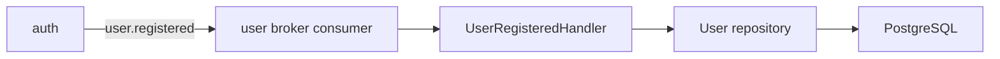
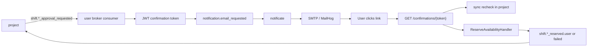

# User Service Architecture

## Purpose

`user` owns the user-facing operational model around people, their resources, their availability, and time reservations.

It is the source of truth for:

- local user projection built from `auth` registration events;
- user descriptions;
- user free time windows;
- equipment and requisites owned by users;
- resource free-time windows;
- image metadata and storage references for requisites;
- committed availability reservations;
- confirmation-link generation for reservation approval.

It does not own:

- account credentials and JWT issuance;
- projects, shifts, and project membership;
- project-side reservation status orchestration.

## Runtime Model

The service runs as one FastAPI process created in [main.py](../main.py).

At startup it:

- loads configuration from [app/config.py](../app/config.py);
- creates a RabbitMQ broker;
- wires Dishka through [app/ioc.py](../app/ioc.py);
- starts ORM mappings;
- declares exchanges and queues for both auth-driven and project-driven events;
- mounts HTTP endpoints from [app/presentation/api.py](../app/presentation/api.py);
- mounts event subscribers from [app/presentation/broker.py](../app/presentation/broker.py).

Runtime dependencies:

- PostgreSQL for user/resource/availability state;
- RabbitMQ for inbound and outbound integration events;
- local/S3/MinIO-compatible storage for image binaries;
- synchronous HTTP client to `project` for approval-state recheck during email confirmation.

## Composition Root

Main composition files:

- [main.py](../main.py)
- [app/config.py](../app/config.py)
- [app/ioc.py](../app/ioc.py)
- [app/set_log.py](../app/set_log.py)

These files assemble:

- repositories;
- domain services and policies;
- storage adapter;
- event publisher;
- confirmation token service;
- HTTP approval-state client for `project`.

## Layered Structure

### Presentation

Files:

- [app/presentation/api.py](../app/presentation/api.py)
- [app/presentation/broker.py](../app/presentation/broker.py)
- [app/presentation/schemas.py](../app/presentation/schemas.py)
- [app/presentation/http/project_service.py](../app/presentation/http/project_service.py)

Responsibilities:

- expose HTTP API for profiles, resources, free-time windows, reservations, and confirmation links;
- expose a public `GET /confirmations/{token}` endpoint for one-click reservation approval;
- subscribe to `auth` and `project` events;
- translate HTTP/broker payloads into application commands and queries.

### Application

Files:

- [app/application/commands](../app/application/commands)
- [app/application/queries](../app/application/queries)
- [app/application/ports](../app/application/ports)

Important handlers:

- [app/application/commands/user_registered.py](../app/application/commands/user_registered.py)
- [app/application/commands/check_availability.py](../app/application/commands/check_availability.py)
- [app/application/commands/reserve_availability.py](../app/application/commands/reserve_availability.py)
- [app/application/commands/approval_notifications.py](../app/application/commands/approval_notifications.py)
- [app/application/commands/confirm_reservation.py](../app/application/commands/confirm_reservation.py)

Responsibilities:

- orchestrate CRUD and reservation use cases;
- publish integration events;
- generate notification requests when approval is needed;
- confirm reservation by signed token after syncing current project state.

### Domain

Files:

- [app/domain/entity](../app/domain/entity)
- [app/domain/policy](../app/domain/policy)
- [app/domain/service](../app/domain/service)
- [app/domain/specification](../app/domain/specification)
- [app/domain/value](../app/domain/value)

Responsibilities:

- model users, resources, free-time windows, images, and reservation facts;
- enforce ownership, overlap, single-description, and unlocked-resource rules;
- encapsulate interval slicing and reservation logic in domain services.

### Infrastructure

Files:

- [app/infrastructure/adapters/repository.py](../app/infrastructure/adapters/repository.py)
- [app/infrastructure/adapters/broker.py](../app/infrastructure/adapters/broker.py)
- [app/infrastructure/adapters/storage.py](../app/infrastructure/adapters/storage.py)
- [app/infrastructure/security/confirmation_token.py](../app/infrastructure/security/confirmation_token.py)
- [app/infrastructure/database.py](../app/infrastructure/database.py)
- [app/infrastructure/transactions.py](../app/infrastructure/transactions.py)

Responsibilities:

- persist domain state through SQLAlchemy;
- publish events to RabbitMQ;
- store file binaries through configurable backends;
- create and validate signed confirmation tokens;
- manage DB sessions and transactions.

## State Ownership

The service owns local tables for:

- users;
- descriptions;
- spare times;
- equipment items and their free-time windows;
- images;
- availability reservations.

Design choice for the email approval flow:

- there is no separate pending-confirmation table in `user`;
- approval links are stateless signed tokens;
- current truth is revalidated synchronously against `project` before final reserve.

This keeps `project` as the owner of reservation workflow state, while `user` owns only the actual availability and reservation facts.

## Main Flows

### 1. User projection from auth

Flow:

1. `auth` emits `user.registered`.
2. `user` consumes it through [app/presentation/broker.py](../app/presentation/broker.py).
3. A local user record is created.
4. All later user/resource logic works against this local projection.

### 2. Direct HTTP CRUD over user state

The HTTP API in [app/presentation/api.py](../app/presentation/api.py) owns synchronous CRUD over:

- descriptions;
- spare times;
- equipment entities;
- equipment free-time windows;
- images for requisites.

The gateway forwards `X-User-Id`, and the service uses that header as the trusted actor identity.

### 3. Availability check and reserve for project

Project-to-user reservation is event-driven.

Incoming event types:

- `shift.participant_reservation_check_requested`
- `shift.resource_request_reservation_check_requested`
- `shift.participant_reservation_requested`
- `shift.resource_request_reservation_requested`

Behavior:

- check events validate that an interval can be reserved but do not mutate final reservation state;
- reserve events slice the free window and persist a reservation fact;
- the service emits success or failure events back to `project`.

### 4. Approval email flow

This is the current interservice approval design:

Detailed steps:

1. `project` moves a participant or resource request into `RESERVING`.
2. `project` emits `shift.participant_approval_requested` or `shift.resource_request_approval_requested`.
3. `user` receives the event and builds a signed confirmation link.
4. `user` publishes `notification.email_requested`.
5. `notificate` sends SMTP mail with the link.
6. User opens `/user/confirmations/{token}` through the gateway.
7. `user` decodes the token and rechecks current approval state through [app/presentation/http/project_service.py](../app/presentation/http/project_service.py).
8. If the project-side state still matches and remains `RESERVING`, `user` performs the real availability reserve.
9. `user` emits the final success or failure event back to `project`.

### 5. Public confirmation endpoint

The endpoint:

- lives in [app/presentation/api.py](../app/presentation/api.py);
- returns simple HTML, not JSON;
- is intentionally public and does not require JWT;
- relies on signed token validation plus sync project recheck for safety.

## Integration Contracts

### Incoming

- `user.registered` from `auth`
- reservation check/reserve request events from `project`
- approval-request events from `project`

### Outgoing

- reservation check succeeded/failed
- reservation succeeded/failed
- `notification.email_requested` for `notificate`

### Sync HTTP dependency

The service calls `project` synchronously only for approval-state recheck during confirmation.

Client implementation:

- [app/presentation/http/project_service.py](../app/presentation/http/project_service.py)

This is an intentional exception to the otherwise event-driven flow because email-link confirmation is a synchronous HTTP interaction.

## Storage Model

Image binary storage is abstracted behind [app/application/ports/storage.py](../app/application/ports/storage.py) and configured by [app/config.py](../app/config.py).

Backends:

- `local`
- `s3`
- `minio`

The database stores metadata and object reference fields, while the actual file bytes live in the selected storage backend.

## Security Model

Identity model:

- private CRUD endpoints trust `X-User-Id` from the gateway;
- confirmation links use a separate secret and TTL from auth JWTs;
- confirmation links are stateless and signed, not session-backed.

Current protection layers for approval confirmation:

- signature validation;
- token TTL;
- payload-to-project-state match check;
- idempotent reserve semantics at the availability layer.

## Configuration

Main config groups in [app/config.py](../app/config.py):

- `Log`
- `Rabbitmq`
- `DatabaseSettings`
- `SQLAlchemySettings`
- `StorageSettings`
- `ImageSettings`
- `ProjectService`
- `ConfirmationSettings`

Important env vars:

- `DATABASE_*`
- `RABBITMQ_*`
- `STORAGE_*`
- `IMAGE_*`
- `PROJECT_SERVICE_BASE_URL`
- `PROJECT_SERVICE_INTERNAL_API_KEY`
- `CONFIRMATION_SECRET_KEY`
- `CONFIRMATION_TTL_HOURS`
- `PUBLIC_BASE_URL`

## Testing Focus

Current tests in [test](../test) cover:

- CRUD and domain rules for descriptions/resources/free times;
- availability check and reserve;
- confirmation-token flow;
- interservice reservation integration behavior.

## Current Limitations

- no dedicated audit table for approval-link clicks;
- no revoke or resend management for confirmation links;
- no dead-letter strategy for outbound notification requests;
- some operations still depend on user-activity policies that may belong closer to auth or project boundaries.
