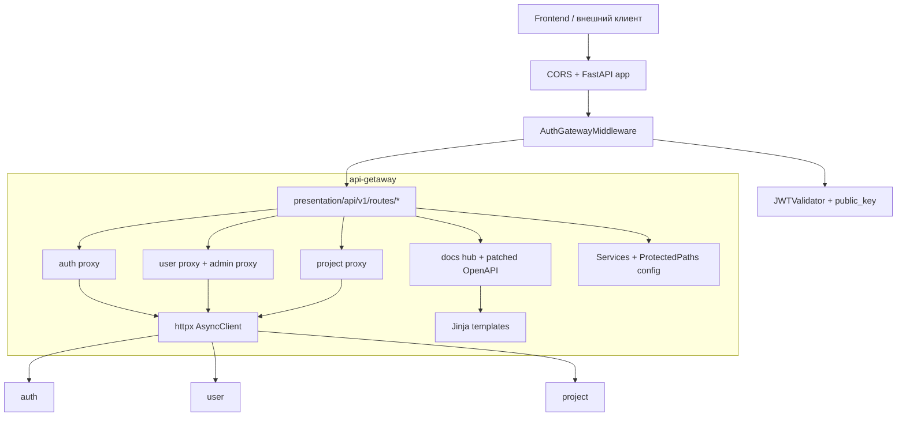
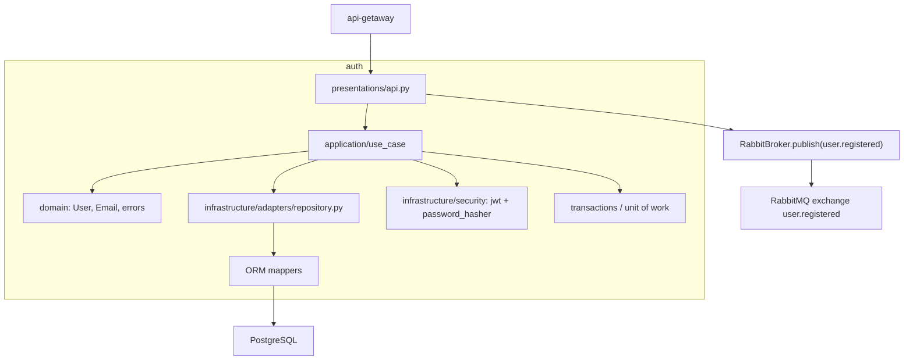
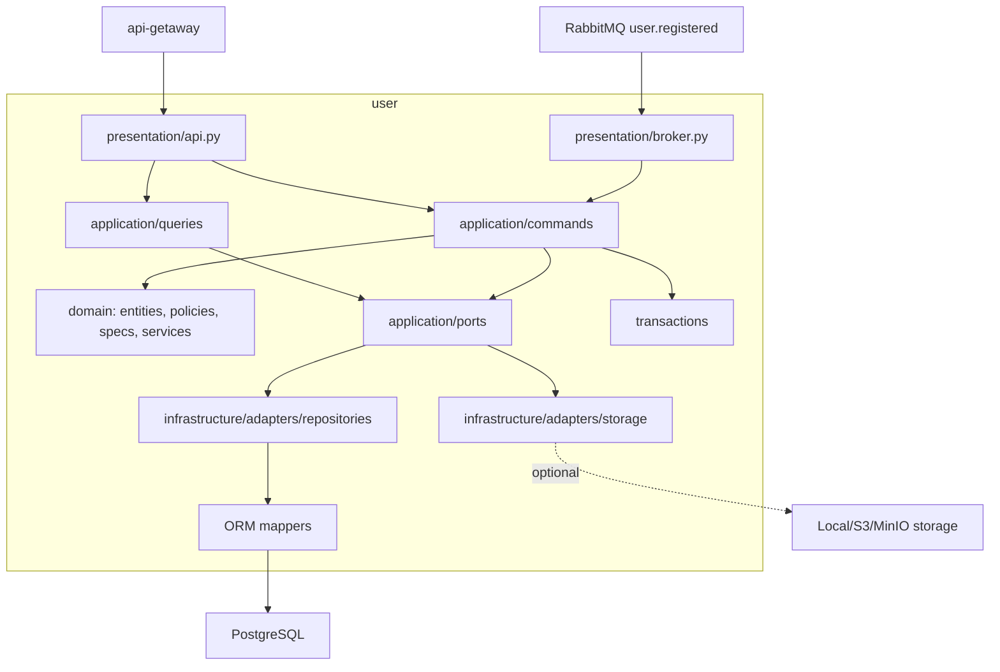
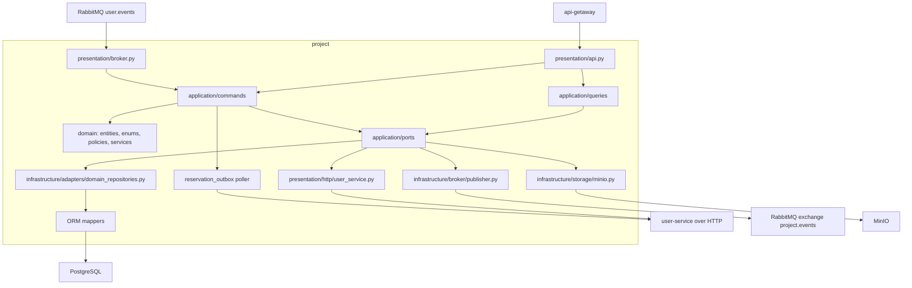
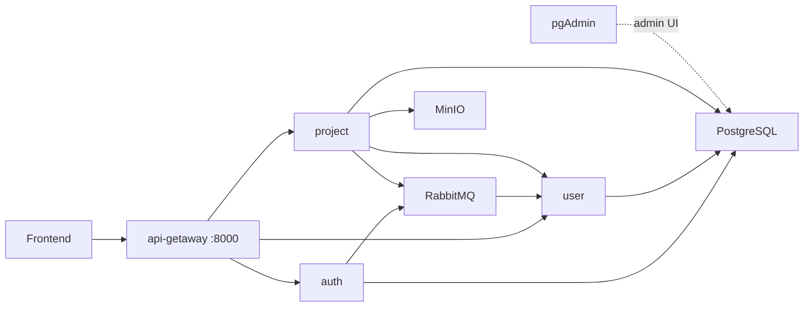

# Архитектурный анализ backend-части `kino`

> Актуально для состояния репозитория на 18 марта 2026 года.  
> Основано на фактическом содержимом [docker-compose.yaml](../docker-compose.yaml), `backend/src/apps/*`, `README.md` и сервисных Markdown-файлов внутри `backend`.

## 1. Краткий вывод

Backend проекта построен как **набор из нескольких сервисов в одном monorepo**, где каждый прикладной сервис имеет собственные точку входа, зависимости, миграции и Docker-образ. В коде явно просматривается стиль **Layered / Clean / Hexagonal Architecture**:

- FastAPI используется как HTTP-слой;
- Dishka используется для dependency injection;
- SQLAlchemy и Alembic закрывают персистентность и миграции;
- RabbitMQ через FastStream используется для событийных интеграций;
- MinIO используется как object storage для документов project-service;
- API Gateway закрывает внешний HTTP-периметр и аутентификацию на границе системы.

Фронтенд в этой схеме выступает только как внешний клиент и должен ходить в систему через `api-getaway`.

## 2. Источники анализа

Ниже перечислены подтвержденные источники, по которым сделаны выводы:

- [docker-compose.yaml](../docker-compose.yaml)
- [README.md](../README.md)
- [backend/README.md](../backend/README.md)
- [backend/src/apps/apigetaway/main.py](../backend/src/apps/apigetaway/main.py)
- [backend/src/apps/auth/main.py](../backend/src/apps/auth/main.py)
- [backend/src/apps/user/main.py](../backend/src/apps/user/main.py)
- [backend/src/apps/project/main.py](../backend/src/apps/project/main.py)
- [backend/src/apps/project/README.md](../backend/src/apps/project/README.md)
- [backend/src/apps/user/README.md](../backend/src/apps/user/README.md)
- [backend/src/apps/project/docs/SPEC.md](../backend/src/apps/project/docs/SPEC.md)
- [backend/src/apps/project/docs/BL_LAYER.md](../backend/src/apps/project/docs/BL_LAYER.md)

## Детальные архитектуры сервисов

- [api-getaway](../backend/src/apps/apigetaway/docs/ARCHITECTURE.md)
- [auth](../backend/src/apps/auth/docs/ARCHITECTURE.md)
- [user](../backend/src/apps/user/docs/ARCHITECTURE.md)
- [project](../backend/src/apps/project/docs/ARCHITECTURE.md)
- [notificate](../backend/src/apps/notificate/docs/ARCHITECTURE.md)

Где ниже встречается формулировка "архитектурная интерпретация", это вывод по структуре кода и зависимостям, а не отдельный явно написанный контракт.

## 3. Структура backend-проекта

Практическая карта backend-части репозитория:

```text
kino/
├── backend/
│   ├── README.md
│   └── src/
│       └── apps/
│           ├── apigetaway/
│           │   ├── app/
│           │   │   ├── application/
│           │   │   ├── infrastructure/
│           │   │   └── presentation/
│           │   ├── tests/
│           │   ├── main.py
│           │   ├── pyproject.toml
│           │   └── Dockerfile
│           ├── auth/
│           │   ├── app/
│           │   │   ├── application/
│           │   │   ├── domain/
│           │   │   ├── infrastructure/
│           │   │   └── presentations/
│           │   ├── migrations/
│           │   ├── tests/
│           │   ├── main.py
│           │   ├── pyproject.toml
│           │   └── Dockerfile
│           ├── user/
│           │   ├── app/
│           │   │   ├── application/
│           │   │   ├── domain/
│           │   │   ├── infrastructure/
│           │   │   └── presentation/
│           │   ├── migrations/
│           │   ├── test/
│           │   ├── tests/
│           │   ├── main.py
│           │   ├── pyproject.toml
│           │   └── Dockerfile
│           └── project/
│               ├── app/
│               │   ├── application/
│               │   ├── domain/
│               │   ├── infrastructure/
│               │   └── presentation/
│               ├── docs/
│               ├── migrations/
│               ├── tests/
│               ├── main.py
│               ├── pyproject.toml
│               └── Dockerfile
├── docker/
│   └── pg-init/
├── docs/
└── docker-compose.yaml
```

### Что это означает архитектурно

- `backend/src/apps/*` содержит **отдельные backend-сервисы**, а не просто модули одного приложения.
- У каждого прикладного сервиса есть свой `Dockerfile`, `pyproject.toml`, `main.py`, `.env` и собственный миграционный контур.
- Общая dev/runtime-топология связывается через один [docker-compose.yaml](../docker-compose.yaml).
- `project` и `user` выглядят как наиболее полные DDD-ориентированные сервисы.
- `apigetaway` отличается по устройству: это не доменный сервис, а пограничный HTTP-компонент.

## 4. Состав сервисов из `docker-compose`

В compose-файле описаны следующие контейнеры:

- `pg` — PostgreSQL
- `pgadmin` — интерфейс администрирования PostgreSQL
- `auth` — сервис аутентификации
- `api-getaway` — внешний HTTP gateway
- `user` — сервис пользователей, ресурсов и доступности
- `project` — сервис проектов, смен, документов и заявок на ресурсы
- `broker` — RabbitMQ
- `minio` — object storage

### Подтвержденные факты из compose

- наружу опубликован `api-getaway` на `8000`;
- `project` опубликован на `8004:8003`;
- `pg`, `pgadmin`, `broker`, `minio` тоже открыты наружу для dev-работы;
- `auth` в compose помечен комментарием `Требуется добавить healthcheck`;
- `user` и `project` в compose помечены как `Сервис не готов`;
- `auth`, `user`, `project` стартуют через `alembic upgrade head` и затем поднимают uvicorn;
- `auth` и `user` завязаны на PostgreSQL, `auth` и `user` работают с RabbitMQ, `project` работает сразу с PostgreSQL, RabbitMQ, HTTP-клиентом к `user` и MinIO.

### Архитектурная интерпретация

Текущая схема соответствует **dev-oriented микросервисной системе**:

- есть явная сервисная декомпозиция по зонам ответственности;
- есть отдельный edge-компонент для входящего HTTP;
- есть отдельные инфраструктурные сервисы для данных, очередей и файлов;
- при этом compose пока отражает скорее разработческое окружение, а не жестко закрытую production-топологию.

## 5. Архитектура сервисов

## 5.1. `api-getaway`

### Назначение

`api-getaway` — это внешний HTTP-периметр системы. Он:

- принимает запросы от фронтенда;
- валидирует JWT на границе;
- определяет защищенные пути;
- пробрасывает trusted headers (`X-User-Id`, `X-User-Token-Type`, `X-User-Is-Superuser`);
- проксирует запросы в `auth`, `user`, `project`;
- собирает и патчит OpenAPI downstream-сервисов.

### Подтверждено кодом

- настройки downstream-сервисов лежат в [app/config.py](../backend/src/apps/apigetaway/app/config.py);
- lifecycle FastAPI и DI-контейнера описан в [main.py](../backend/src/apps/apigetaway/main.py);
- JWT и protected paths подключаются через [app/setup.py](../backend/src/apps/apigetaway/app/setup.py);
- прокси-маршруты реализованы в:
  - [app/presentation/api/v1/routes/auth.py](../backend/src/apps/apigetaway/app/presentation/api/v1/routes/auth.py)
  - [app/presentation/api/v1/routes/users.py](../backend/src/apps/apigetaway/app/presentation/api/v1/routes/users.py)
  - [app/presentation/api/v1/routes/projects.py](../backend/src/apps/apigetaway/app/presentation/api/v1/routes/projects.py)
  - [app/presentation/api/v1/routes/docs.py](../backend/src/apps/apigetaway/app/presentation/api/v1/routes/docs.py)

### Внутренняя структура

- `presentation` — HTTP routes, middleware, Jinja-шаблоны документации
- `infrastructure` — проверка JWT, низкоуровневые утилиты
- `application` — ошибки и сервисные абстракции gateway
- `config` / `ioc` / `setup` — wiring конфигурации, DI и middleware

### Входящие и исходящие интеграции

- вход: HTTP от frontend и внешних клиентов;
- исходящие:
  - HTTP в `auth`
  - HTTP в `user`
  - HTTP в `project`
  - чтение публичного ключа для валидации токена

### Диаграмма сервиса



### Архитектурная интерпретация

Это классический **API Gateway pattern**:

- аутентификация вынесена на периметр;
- фронтенд видит единое API;
- downstream-сервисы получают уже подготовленный контекст пользователя;
- gateway одновременно играет роль портала документации.

## 5.2. `auth`

### Назначение

`auth` отвечает за:

- регистрацию пользователя;
- логин и refresh flow;
- выдачу access/refresh JWT;
- хранение учётных записей;
- admin-выборку пользователей;
- публикацию события `user.registered` в RabbitMQ.

### Подтверждено кодом

- сервис стартует через [main.py](../backend/src/apps/auth/main.py);
- HTTP API описано в [app/presentations/api.py](../backend/src/apps/auth/app/presentations/api.py);
- RSA-ключи подгружаются из [app/config.py](../backend/src/apps/auth/app/config.py);
- exchange `user.registered` объявлен в [app/infrastructure/adapters/broker.py](../backend/src/apps/auth/app/infrastructure/adapters/broker.py);
- зависимости подтверждаются [pyproject.toml](../backend/src/apps/auth/pyproject.toml).

### Внутренняя структура

- `application/use_case` — сценарии аутентификации и пользовательских операций
- `application/ports` — абстракции транзакций и зависимостей
- `domain` — сущности, value objects и доменные ошибки
- `infrastructure/adapters` — ORM, repository, broker
- `infrastructure/security` — JWT и password hashing
- `presentations` — FastAPI-роуты, схемы и handlers ошибок

### Входящие и исходящие интеграции

- вход:
  - HTTP от `api-getaway`
  - PostgreSQL как основное хранилище
- исходящие:
  - RabbitMQ: публикация `user.registered`

### Диаграмма сервиса



### Архитектурная интерпретация

`auth` — это **security service + identity entry point**. Он ближе к классической layered architecture, но уже использует:

- repository pattern;
- unit of work;
- value objects;
- event publication после успешной регистрации.

## 5.3. `user`

### Назначение

`user` — источник правды для:

- пользовательского профиля;
- описания пользователя;
- окон доступности пользователя;
- оборудования и реквизита пользователя;
- окон доступности оборудования;
- изображений реквизита;
- резервирования времени внутри `free`-окон.

### Подтверждено кодом и документацией

- предметная область и API подробно описаны в [README.md](../backend/src/apps/user/README.md);
- HTTP API реализовано в [app/presentation/api.py](../backend/src/apps/user/app/presentation/api.py);
- RabbitMQ subscriber описан в [app/presentation/broker.py](../backend/src/apps/user/app/presentation/broker.py);
- exchange и queue `user.registered` описаны в [app/infrastructure/adapters/broker.py](../backend/src/apps/user/app/infrastructure/adapters/broker.py);
- конфигурация хранилища и изображений описана в [app/config.py](../backend/src/apps/user/app/config.py).

### Внутренняя структура

- `application/commands` — команды записи и резервирования
- `application/queries` — сценарии чтения
- `application/ports` — абстракции репозиториев, хранилища, транзакций
- `domain/entity`, `domain/value`, `domain/policy`, `domain/specification`, `domain/service`
- `infrastructure/adapters` — ORM, repositories, broker, storage
- `presentation` — HTTP и RabbitMQ adapters

### Входящие и исходящие интеграции

- вход:
  - HTTP от `api-getaway`
  - событие `user.registered` из `auth` через RabbitMQ
  - PostgreSQL
- исходящие:
  - опциональная загрузка файлов через storage adapter

### Важное замечание по storage

В коде `user` поддерживает `local | s3 | minio` через `StorageSettings`, но текущий `docker-compose` явно не показывает отдельной проводки env-параметров для MinIO именно в `user-service`. Поэтому для `user` корректно говорить о **плагинной storage-архитектуре**, а не о жестко подтвержденной runtime-связи с MinIO в текущем compose.

### Диаграмма сервиса



### Архитектурная интерпретация

`user` — это **domain-rich service** с выраженными тактическими DDD-элементами:

- commands/queries разделены физически;
- policies и specifications инкапсулируют правила предметной области;
- внешний event `user.registered` переводится во внутреннюю запись пользователя;
- сервис является источником правды для availability и user-owned resources.

## 5.4. `project`

### Назначение

`project` отвечает за:

- проекты и участников проекта;
- роли участников;
- смены;
- участников смен;
- документы смен;
- заявки на ресурсы;
- резервирование участников и ресурсов через `user-service`;
- публикацию событий о важных изменениях проекта.

### Подтверждено кодом и документацией

- границы ответственности описаны в [README.md](../backend/src/apps/project/README.md);
- предметная модель и ERD описаны в [docs/SPEC.md](../backend/src/apps/project/docs/SPEC.md);
- описание BL-слоя есть в [docs/BL_LAYER.md](../backend/src/apps/project/docs/BL_LAYER.md);
- HTTP API находится в [app/presentation/api.py](../backend/src/apps/project/app/presentation/api.py);
- RabbitMQ subscriber находится в [app/presentation/broker.py](../backend/src/apps/project/app/presentation/broker.py);
- HTTP ACL к `user-service` находится в [app/presentation/http/user_service.py](../backend/src/apps/project/app/presentation/http/user_service.py);
- публикация событий в `project.events` описана в [app/infrastructure/broker/publisher.py](../backend/src/apps/project/app/infrastructure/broker/publisher.py);
- MinIO adapter находится в [app/infrastructure/storage/minio.py](../backend/src/apps/project/app/infrastructure/storage/minio.py);
- outbox-обработка резервов находится в [app/application/commands/reservation_outbox.py](../backend/src/apps/project/app/application/commands/reservation_outbox.py).

### Внутренняя структура

- `application/commands` — сценарии изменения проекта, смен, документов, заявок и резервов
- `application/queries` — сценарии чтения
- `application/ports` — порты репозиториев, брокера, транзакций, user-service
- `domain` — сущности, enum, value objects, policy, services, domain events
- `infrastructure/adapters` — ORM и репозитории
- `infrastructure/broker` — publisher и consumer
- `infrastructure/storage` — MinIO adapter
- `presentation` — HTTP API, broker adapter, HTTP ACL к user-service

### Входящие и исходящие интеграции

- вход:
  - HTTP от `api-getaway`
  - PostgreSQL
  - RabbitMQ subscriber для `user.events` / `project.member.approved`
- исходящие:
  - HTTP в `user-service`
  - RabbitMQ: `project.events`
  - MinIO для документов

### Диаграмма сервиса



### Архитектурная интерпретация

`project` — самый зрелый orchestration-сервис в системе:

- здесь концентрируется основная предметная логика планирования;
- здесь же видны элементы eventual consistency;
- сервис уже использует outbox-подход для резервирования;
- он публикует события, которые подходят для будущих подписчиков и производных сервисов.

## 6. Инфраструктурные контейнеры

Эти сервисы не имеют собственной прикладной внутренней архитектуры в репозитории, но играют важную роль в runtime-системе.

## 6.1. `pg`

- роль: единый PostgreSQL-сервер для backend-сервисов;
- подтверждение: контейнер `pg`, volume `pg_data`, инициализация через `docker/pg-init`;
- архитектурная функция: персистентность, миграции и хранение доменных данных.

## 6.2. `pgadmin`

- роль: dev/admin UI для PostgreSQL;
- подтверждение: контейнер `pgadmin`, volume `pgadmin_data`, публикация порта `5050`;
- архитектурная функция: ручная проверка схем и данных в dev-окружении.

## 6.3. `broker`

- роль: RabbitMQ management + message broker;
- подтверждение: контейнер `broker`, порты `5672` и `15672`, healthcheck;
- архитектурная функция:
  - асинхронные интеграции;
  - доставка событий;
  - decoupling между сервисами.

## 6.4. `minio`

- роль: S3-совместимое object storage;
- подтверждение: контейнер `minio`, порты `9000` и `9001`, volume `minio_data`, healthcheck;
- архитектурная функция: хранение документов project-service и потенциальная база для других файловых сценариев.

## 7. Общая архитектура системы

### Сводная диаграмма



### Что подтверждено

- `Frontend -> api-getaway` является целевой клиентской схемой;
- `api-getaway -> auth/user/project` подтверждено кодом proxy-роутов;
- `auth -> RabbitMQ -> user` подтверждено exchange `user.registered` и subscriber в `user`;
- `project -> user` подтверждено HTTP ACL в `project`;
- `project -> RabbitMQ` подтверждено publisher в `project.events`;
- `project -> MinIO` подтверждено storage adapter и конфигом MinIO в `project`;
- `auth/user/project -> PostgreSQL` подтверждено конфигами БД и миграциями.

### Важная оговорка

В коде `project` также есть подписчик на `user.events` с queue `project.member.approved.project`. Это подтвержденная точка расширения, но по текущему состоянию репозитория она выглядит как **частично подготовленная интеграция**, а не как уже полностью описанный end-to-end поток в compose и соседних сервисах.

## 8. Плюсы такой системы

## 8.1. Разделение ответственности по bounded context

- `auth` изолирует аутентификацию и выпуск токенов;
- `user` владеет профилем, ресурсами и доступностью;
- `project` владеет планированием съемочного процесса;
- `api-getaway` изолирует внешний HTTP-периметр.

Это уменьшает смешение доменной логики и делает систему понятнее для развития.

## 8.2. Независимая эволюция сервисов

Каждый backend-сервис имеет:

- собственный Dockerfile;
- собственный `pyproject.toml`;
- собственные миграции;
- собственный runtime lifecycle.

Это позволяет развивать прикладные области независимо, не превращая backend в один крупный монолит.

## 8.3. Сочетание синхронных и асинхронных интеграций

- HTTP используется там, где нужен немедленный ответ;
- RabbitMQ используется там, где нужен событийный обмен и слабая связность.

Такой гибридный подход обычно практичнее, чем попытка решить все взаимодействия только одним способом.

## 8.4. Edge-auth через gateway

Проверка JWT и маршрутизация происходят на границе системы. Это дает:

- единый способ аутентификации для клиентов;
- единый публичный вход в систему;
- возможность централизованно управлять protected paths.

## 8.5. Изоляция файлового хранилища

Документы project-service вынесены в MinIO, а не хранятся в PostgreSQL как бинарные blob-объекты. Это полезно потому, что:

- бизнес-метаданные и файлы разделены;
- проще масштабировать object storage отдельно;
- проще строить presigned URLs и файловые политики.

## 8.6. Пригодность для тестирования и расширения

Использование DI, ports/adapters и отдельных application handlers упрощает:

- модульное тестирование;
- замену инфраструктурных адаптеров;
- добавление новых интеграций;
- локализацию бизнес-правил внутри domain/application слоев.

## 8.7. Подготовленность к дальнейшему развитию

Особенно в `project` уже есть база для дальнейших сервисов и подписчиков:

- `project.events` как шина доменно значимых фактов;
- outbox/poller для сценариев eventual consistency;
- явные ACL-границы с внешним `user-service`.

## 9. Текущие ограничения и незавершенные части

Ниже перечислено только то, что подтверждено текущим кодом, compose или документацией.

- В [docker-compose.yaml](../docker-compose.yaml) `auth` помечен комментарием о необходимости healthcheck.
- В том же compose `user` и `project` помечены как `Сервис не готов`.
- Compose выраженно ориентирован на dev-режим:
  - наружу опубликованы внутренние сервисы и инфраструктура;
  - код монтируется volume-ами в контейнеры;
  - `api-getaway` стартует с `--reload`.
- Внутренняя структура backend не до конца унифицирована:
  - `apigetaway` против `api-getaway`;
  - `presentation` и `presentations`;
  - `test` и `tests` одновременно.
- В `project` уже существует подписчик на `user.events`, но по репозиторию в целом это пока скорее точка для будущего потока, чем полностью оформленная сквозная интеграция.

## 10. Подтвержденные точки расширения

### `project.events`

Сервис `project` уже публикует события в exchange `project.events`. Это делает его естественным источником событий для:

- будущих подписчиков;
- производных аналитических процессов;
- сервисов уведомлений и реактивных интеграций.

### `notification-service` как future scope

В документации `project` есть упоминания notification-сценариев, но в текущем compose и структуре `backend/src/apps` **нет существующего `notification-service`**. Поэтому корректная формулировка такая:

- поддержка уведомлений заложена архитектурно;
- точка расширения уже видна по событиям `project`;
- отдельного notification-сервиса в текущей системе пока нет.

## 11. Итог

Текущий backend `kino` — это уже не набор случайных CRUD-сервисов, а осмысленная сервисная архитектура с явным разделением ролей:

- `api-getaway` — HTTP-периметр и edge-auth;
- `auth` — identity и выпуск токенов;
- `user` — профиль, ресурсы и доступность;
- `project` — orchestration и доменная логика съемочного процесса;
- `pg`, `broker`, `minio`, `pgadmin` — опорная инфраструктура среды.

Главное достоинство системы — удачное сочетание прикладной декомпозиции, DI, ports/adapters, событийных интеграций и отдельного gateway-слоя. Главный текущий компромисс — dev-ориентированность compose и незавершенность части сервисных сценариев, о чем прямо говорят и compose-комментарии, и часть внутренних документов.
