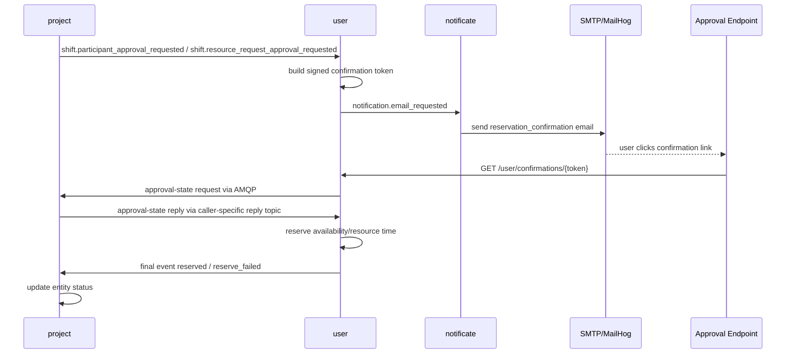

# Reservation Email Approval Flow

Date: 2026-03-29

## Goal

The current reservation approval flow is built around explicit confirmation by email.

Target behavior:
- `project` moves entity to `RESERVING`
- `user` generates signed confirmation link
- `notificate` sends email with that link
- user clicks the link
- `user` performs final reserve
- `project` receives final state event and moves entity to `RESERVED` or `RESERVE_FAILED`

This flow is implemented without a separate pending-approval table in `user`.

## Service Responsibilities

### `project`

Responsibilities:
- own project, shift, participant, and resource-request state
- move participant/resource request into `RESERVING`
- publish approval-request domain events
- answer approval-state request/reply messages for current workflow state
- apply final reservation result events from `user`

Implemented now:
- publishes:
  - `shift.participant_approval_requested`
  - `shift.resource_request_approval_requested`
- consumes:
  - `shift.participant_approval_state_requested`
  - `shift.resource_request_approval_state_requested`
- consumes final events from `user` and updates state to `RESERVED` or `RESERVE_FAILED`

### `user`

Responsibilities:
- own availability and actual reservation records
- generate signed confirmation tokens
- build public confirmation links
- recheck current approval state from `project` through broker request/reply
- perform final reserve after link click
- publish final reservation result back to `project`

Implemented now:
- consumes:
  - `shift.participant_approval_requested`
  - `shift.resource_request_approval_requested`
- publishes:
  - `notification.email_requested`
  - `shift.participant_reserved.user`
  - `shift.participant_reserve_failed`
  - `shift.resource_request_reserved.user`
  - `shift.resource_request_reserve_failed`
- exposes public confirmation endpoint:
  - `GET /confirmations/{token}`

Important design choice:
- no extra pending table is used in `user`
- idempotency is achieved by signed token, TTL, recheck against `project`, and reservation command semantics

### `notificate`

Responsibilities:
- consume notification request events
- push delivery to background task execution
- send email via SMTP

Implemented now:
- consumes `notification.email_requested` from `user.events`
- schedules `notificate.send_notification_email` in `taskiq`
- sends `reservation_confirmation` email through SMTP

### `api-getaway`

Responsibilities:
- expose public confirmation path without JWT
- proxy normal authenticated service routes

Implemented now:
- public path:
  - `/user/confirmations/*`
- standard user/project/auth proxying remains protected

## Implemented Flow

## Implemented Contracts

### `project -> user`

Participant:
- `shift.participant_approval_requested`

Payload includes:
- `request_id`
- `project_id`
- `project_title`
- `shift_id`
- `shift_title`
- `participant_id`
- `user_id`
- `role`
- `time_from`
- `time_to`

Resource:
- `shift.resource_request_approval_requested`

Payload includes:
- `request_id`
- `project_id`
- `project_title`
- `shift_id`
- `shift_title`
- `resource_request_id`
- `owner_user_id`
- `resource_id`
- `resource_type`
- `time_from`
- `time_to`

### `user -> notificate`

Event:
- `notification.email_requested`

Payload includes:
- `notification_id`
- `recipient_email`
- `subject`
- `template`
- `payload.confirm_url`
- `payload.project_title`
- `payload.shift_title`
- `payload.time_from`
- `payload.time_to`
- `payload.role`
- `payload.resource_type`

### `user -> project`

Approval-state request/reply:
- request topics:
  - `shift.participant_approval_state_requested`
  - `shift.resource_request_approval_state_requested`
- reply payloads are published to caller-specific reply topics:
  - `user.reply.<instance_id>`
- reply payload includes `response_type` with one of:
  - `shift.participant_approval_state_provided`
  - `shift.participant_approval_state_failed`
  - `shift.resource_request_approval_state_provided`
  - `shift.resource_request_approval_state_failed`

Final participant events:
- `shift.participant_reserved.user`
- `shift.participant_reserve_failed`

Final resource events:
- `shift.resource_request_reserved.user`
- `shift.resource_request_reserve_failed`

## HTTP Interfaces Used In The Flow

Public:
- `GET /user/confirmations/{token}` via gateway

## What Is Verified Now

Automated tests currently cover:
- project approval-request event contracts
- user confirmation-token flow
- user reserve success and already-processed cases
- notificate scheduling and email rendering
- api-gateway public confirmation route

Live interservice smoke is also verified:
- participant flow:
  - `RESERVING -> RESERVED`
  - email delivered
  - confirmation link works
  - repeated click is idempotent
- resource flow:
  - `RESERVING -> RESERVED`
  - email delivered
  - confirmation link works
  - repeated click is idempotent

## Known Boundaries

Current intentional limitations:
- no separate pending-approval persistence in `user`
- no resend flow
- no reject-by-email flow
- no delivery status storage in `notificate`
- no bounce processing
- no per-template retry strategy

Current domain nuance:
- participants cannot be changed after shift approval; this is existing domain behavior, not an integration bug
